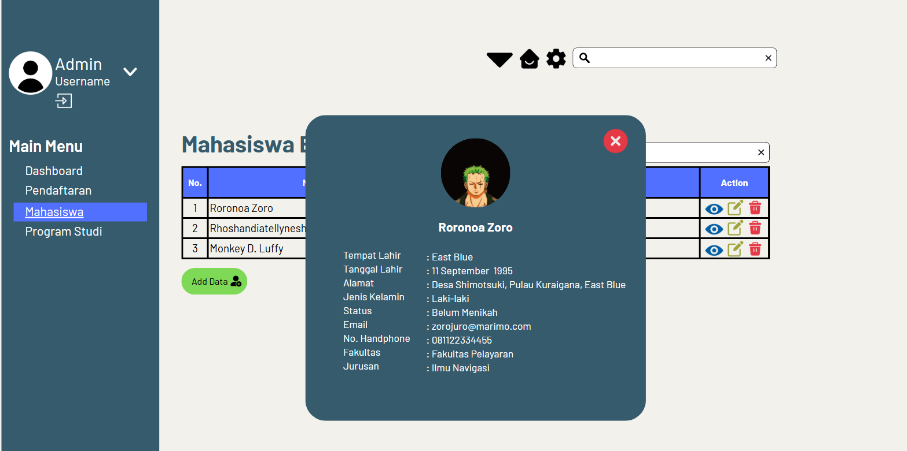
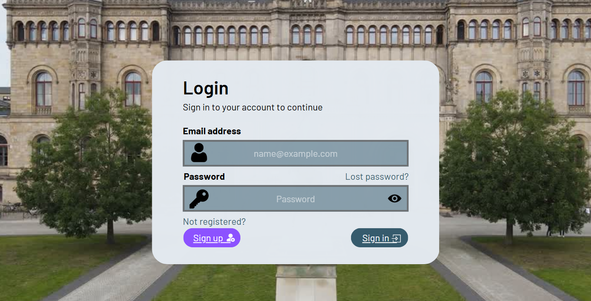
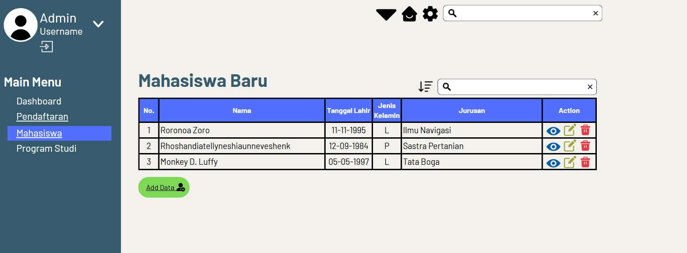
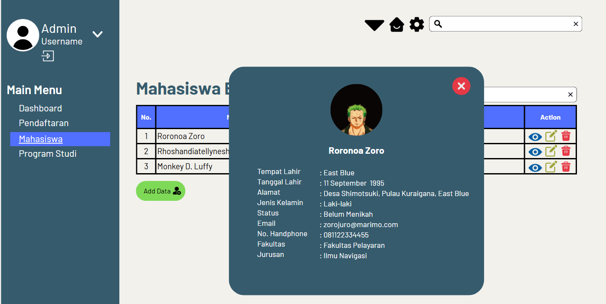
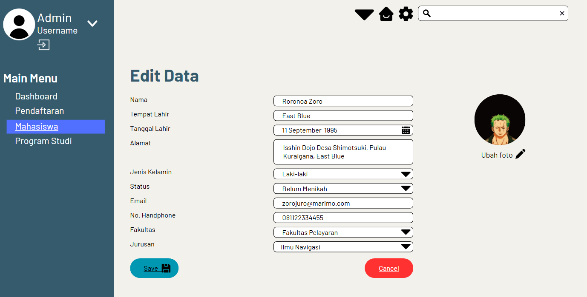
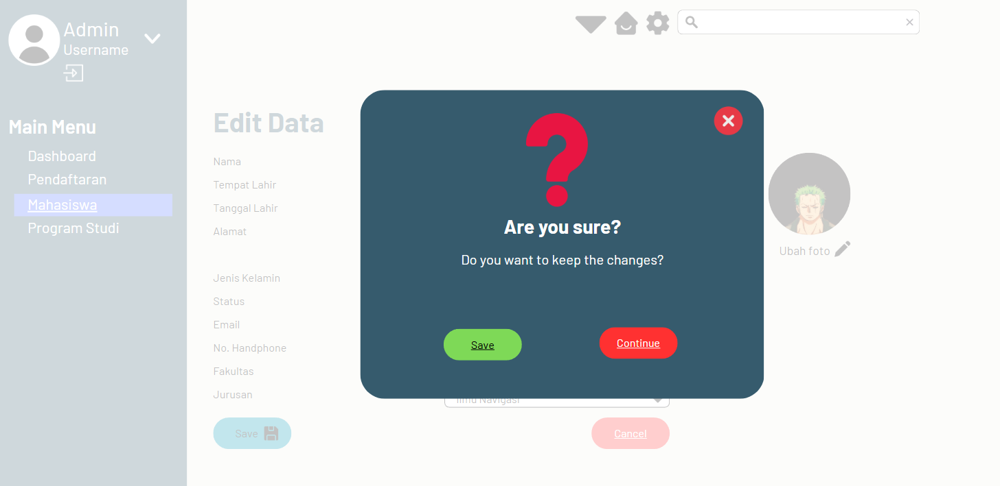
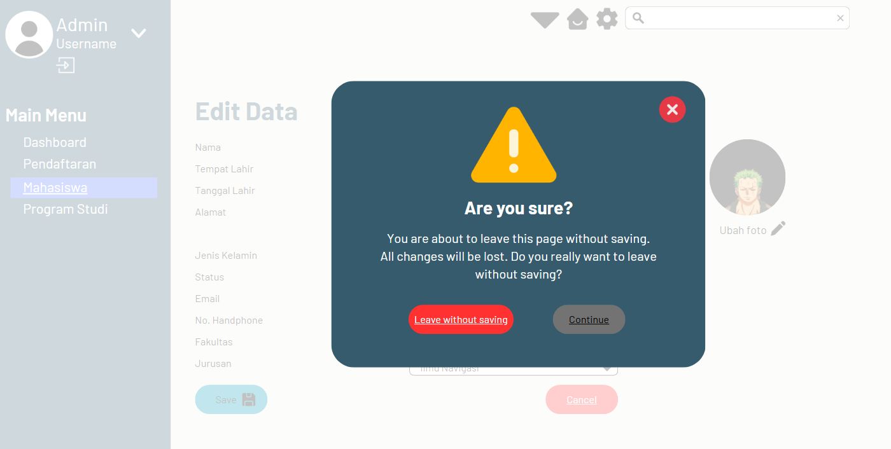
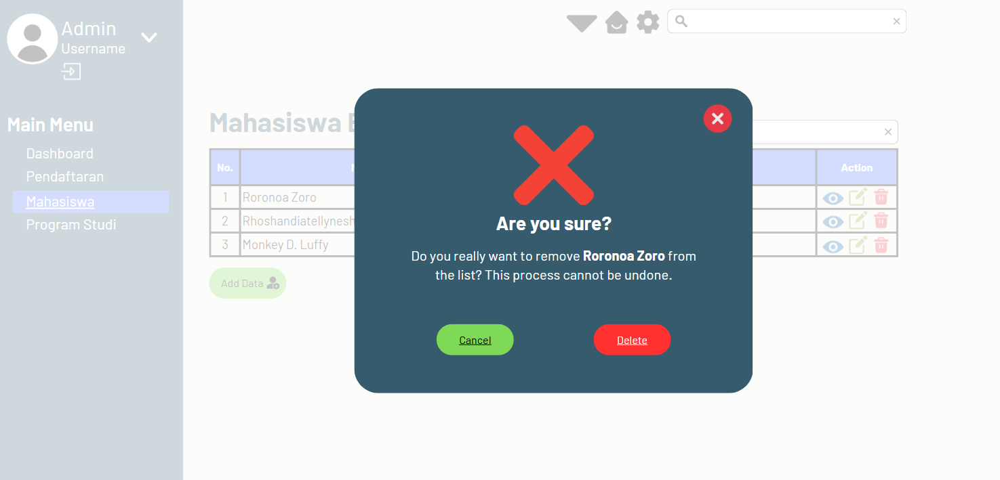

# Mockup Aplikasi Pendaftaran Mahasiswa Baru (**Maba**)

### Description:
Ini merupakan gambaran dari aplikasi untuk penerimaan mahasiswa baru (**Maba**) yang didesain menggunakan Canva. Aplikasi yang didesain untuk memudahkan pendataan data diri mahasiswa baru.

Tujuan dari pembuatan desain ini sebagai blueprint dari aplikasi penerimaan mahasiswa baru (**Maba**) yang akan dibuat, serta memberikan gambaran secara sederhana mengenai fitur-fitur yang akan tersedia pada aplikasi.

### Requirement:
Berikut beberapa hal yang diperlukan untuk melihat desain aplikasi **Maba**:
- Koneksi Internet
- Browser/Aplikasi Canva

### Installation (Guide)
>- Pastikan device yang anda gunakan sudah terhubung dengan internet
>- Pastikan anda memiliki link akses desain website penerimaan mahasiswa baru (**Maba**)
>- Ketikan link akses tersebut pada browser yang anda gunakan
>- Anda dapat melihat gambaran desain dari aplikasi penerimaan mahasiswa baru(**Maba**)

Anda dapat mengakses link desain aplikasi tersebut pada:
[Click Here](https://omjo.my.canva.site/maba)

### Documentation
- Halaman login

- Halaman mahasiswa

- Detail informasi mahasiswa

-Edit data mahasiswa

- Pop up

